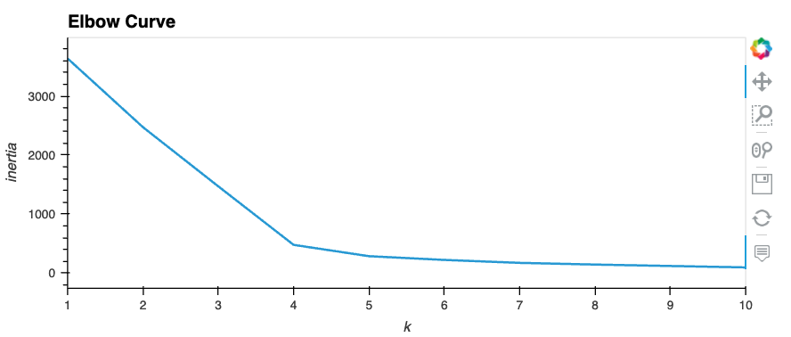

# Cryptocurrencies

Unsupervised Machine Learning and Cryptocurrencies

## Purpose:
A client asked for a list of tradable cryptocurrencies and wants to be able to pick them from a classification system.

* Describe the differences between supervised and unsupervised learning, including real-world examples of each.
* Preprocess data for unsupervised learning.
* Cluster data using the K-means algorithm.
* Determine the best number of centroids for K-means using the elbow curve.
* Use PCA to limit features and speed up the model.

## Results:

### The imported DataFrame before cleaning, 1252 rows of data:

### The list of tradable cryptocurrencies after cleaning, 532 rows of data:

### K-means Clustering Algorithm, Elbow Curve:

### Applying the Principal Component Analysis:

### 3D Scatterplot with Clusters, Visualizing Tradable Cryptocurrencies:

### DataFrame to plot results:

### Tradable Cryptocurrencies:

